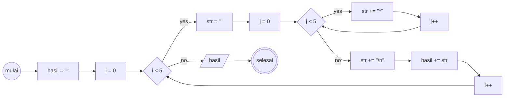
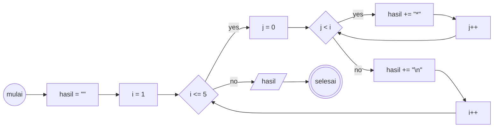
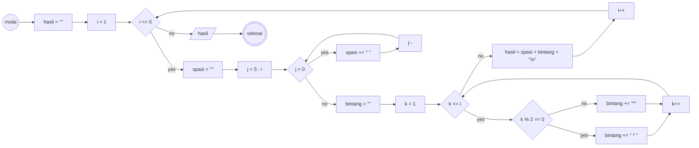
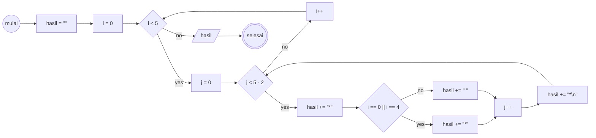

```mermaid

flowchart LR
    Start((mulai))

    I[i = 0]
    TambahI[i++]
    
    J[j = 0]
    TambahJ[j++]

    Hasil[hasil = #quot;#quot;]
    Str[str = #quot;#quot;]
    ConcatBintangStr[str += #quot;*#quot;]
    ConcatBreakStr[str += #quot;#92;n#quot;]
    ConcatStrHasil[hasil += str]
    CekI{i < 5}
    CekJ{j < 5} 
    CetakHasil[/hasil/]
    End(((selesai)))

    Start --> Hasil
    Hasil --> I
    I --> CekI
    CekI --> |yes| Str
    Str --> J
    J --> CekJ

    CekJ --> |yes| ConcatBintangStr
    ConcatBintangStr --> TambahJ
    TambahJ --> CekJ

    CekJ --> |no| ConcatBreakStr
    ConcatBreakStr --> ConcatStrHasil
    ConcatStrHasil --> TambahI
    TambahI --> CekI

    CekI --> |no| CetakHasil
    CetakHasil --> End

```

# Bentuk ke 2

```mermaid

flowchart LR
    Start((mulai))

    I[i = 1]
    J[j = 0]

    TambahI[i++]
    TambahJ[j++]

    CekI{i <= 5}
    CekJ{j < i}

    Hasil[hasil = #quot;#quot;]
    ConcatStr[hasil += #quot;*#quot;]
    ConcatStrBreak[hasil += #quot;#92;n#quot;]
    
    CetakHasil[/hasil/]

    End(((selesai)))

    Start --> Hasil
    Hasil --> I
    I --> CekI
    
    CekI --> |yes| J
    J --> CekJ

    CekJ --> |yes| ConcatStr
    ConcatStr --> TambahJ
    TambahJ --> CekJ

    CekJ --> |no| ConcatStrBreak
    ConcatStrBreak --> TambahI
    TambahI --> CekI

    CekI --> |no| CetakHasil
    CetakHasil --> End

```

# PR
### Segitiga Sama Kaki

```mermaid

flowchart LR

    Start((mulai))

    I[i = 1]
    J[j = 5 - i]
    K[k = 1]

    CekI{i <= 5}
    CekJ{j > 0}
    CekK{k <= i}

    TambahI[i++]
    KurangJ[j--]
    TambahK[k++]

    Hasil[hasil = #quot;#quot;]
    Spasi[spasi = #quot;#quot;]
    Bintang[bintang = #quot;#quot;]

    CekKGenap{k % 2 == 0}

    ConcatSpasi[spasi += #quot; #quot;]
    ConcatBintangBintang[bintang += #quot;*#quot;]
    ConcatBintangSpasi[bintang += #quot; * #quot;]

    ConcatSpasiDanBintangKeHasil[hasil = spasi + bintang + #quot;#92;n#quot;]

    CetakHasil[/hasil/]

    End(((selesai)))

    Start --> Hasil 
    Hasil --> I
    I --> CekI

    CekI --> |yes| Spasi
    Spasi --> J
    J -->  CekJ

    CekJ --> |yes| ConcatSpasi 
    ConcatSpasi --> KurangJ
    KurangJ --> CekJ
    CekJ --> |no| Bintang

    Bintang --> K
    K --> CekK
    CekK --> |yes| CekKGenap
    CekKGenap --> |yes| ConcatBintangSpasi
    CekKGenap --> |no| ConcatBintangBintang
    ConcatBintangSpasi & ConcatBintangBintang  --> TambahK
    TambahK --> CekK
    CekK --> |no| ConcatSpasiDanBintangKeHasil
    ConcatSpasiDanBintangKeHasil --> TambahI

    TambahI --> CekI
    CekI --> |no| CetakHasil
    CetakHasil --> End

```
### Keliling Persegi

```mermaid

flowchart LR
    Start((mulai))

    Hasil[hasil = #quot;#quot;]

    I[i = 0]
    J[j = 0]

    CekI{i < 5}
    CekJ{j < 5 - 2}

    TambahI[i++]
    TambahJ[j++]


    ConcatBintangBintangSebelum[hasil += #quot;*#quot;]
    ConcatBintangSpasi[hasil += #quot; #quot;]
    ConcatBintangBintangLoop[hasil += #quot;*#quot;]
    ConcatBintangBintangSesudah[hasil += #quot;*#92;n#quot;]

    CetakHasil[/hasil/]

    CekNilaiAwalAtauAkhir{"i == 0 || i == 4"}

    End(((selesai)))

    Start --> Hasil
    Hasil --> I
    I --> CekI

    CekI --> |yes| J
    J --> CekJ

    CekJ --> |yes| ConcatBintangBintangSebelum 
    ConcatBintangBintangSebelum --> CekNilaiAwalAtauAkhir
    CekNilaiAwalAtauAkhir --> |yes| ConcatBintangBintangLoop
    CekNilaiAwalAtauAkhir --> |no| ConcatBintangSpasi
    ConcatBintangBintangLoop & ConcatBintangSpasi --> TambahJ 
    TambahJ --> ConcatBintangBintangSesudah
    ConcatBintangBintangSesudah --> CekJ

    CekJ --> |no| TambahI
    TambahI --> CekI

    CekI --> |no| CetakHasil
    CetakHasil --> End


```
