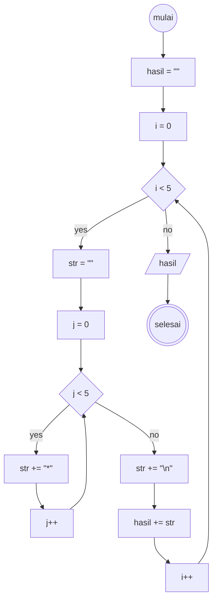
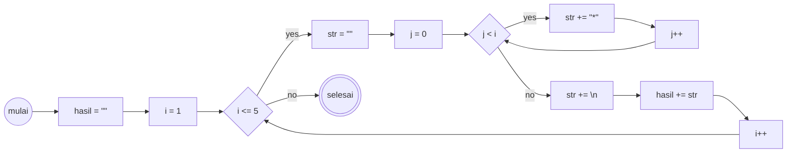

```mermaid

flowchart TB
    Start((mulai))

    I[i = 0]
    TambahI[i++]
    
    J[j = 0]
    TambahJ[j++]

    Hasil[hasil = #quot;#quot;]
    Str[str = #quot;#quot;]
    ConcatBintangStr[str += #quot;*#quot;]
    ConcatBreakStr[str += #quot;#92;n#quot;]
    ConcatStrHasil[hasil += str]
    CekI{i < 5}
    CekJ{j < 5} 
    CetakHasil[/hasil/]
    End(((selesai)))

    Start --> Hasil
    Hasil --> I
    I --> CekI
    CekI --> |yes| Str
    Str --> J
    J --> CekJ

    CekJ --> |yes| ConcatBintangStr
    ConcatBintangStr --> TambahJ
    TambahJ --> CekJ

    CekJ --> |no| ConcatBreakStr
    ConcatBreakStr --> ConcatStrHasil
    ConcatStrHasil --> TambahI
    TambahI --> CekI

    CekI --> |no| CetakHasil
    CetakHasil --> End

```

### Bentuk ke 2

```mermaid

flowchart LR
    Start((mulai))

    I[i = 1]
    J[j = 0]

    TambahI[i++]
    TambahJ[j++]

    CekI{i <= 5}
    CekJ{j < i}

    Hasil[hasil = #quot;#quot;]
    TempStr[str = #quot;#quot;]
    ConcatStr[str += #quot;*#quot;]
    ConcatStrBreak[str += #92;n]
    ConcatStrHasil[hasil += str]

    End(((selesai)))

    Start --> Hasil
    Hasil --> I
    I --> CekI
    
    CekI --> |yes| TempStr
    TempStr --> J
    J --> CekJ

    CekJ --> |yes| ConcatStr
    ConcatStr --> TambahJ
    TambahJ --> CekJ

    CekJ --> |no| ConcatStrBreak
    ConcatStrBreak --> ConcatStrHasil

    ConcatStrHasil --> TambahI
    TambahI --> CekI

    CekI --> |no| End

```
